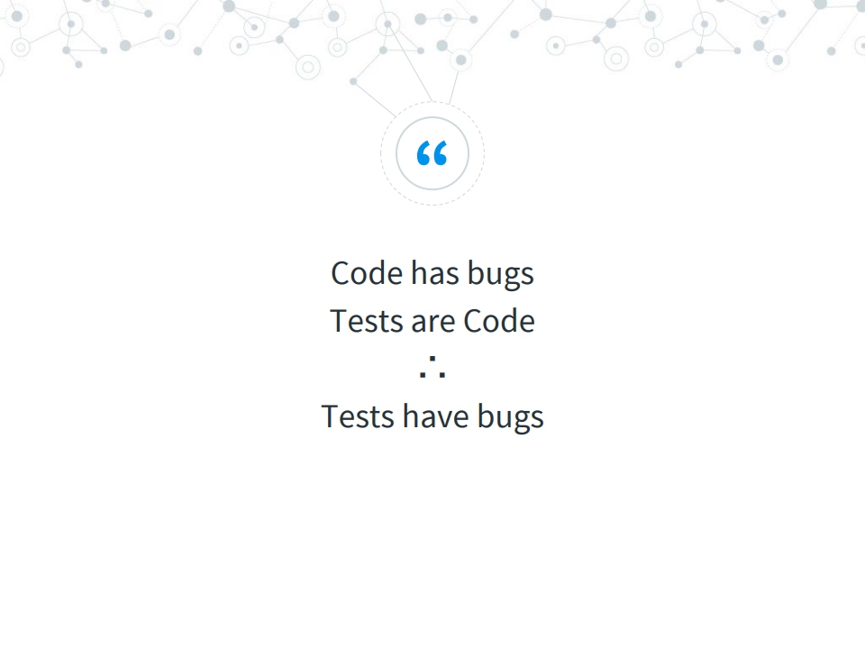
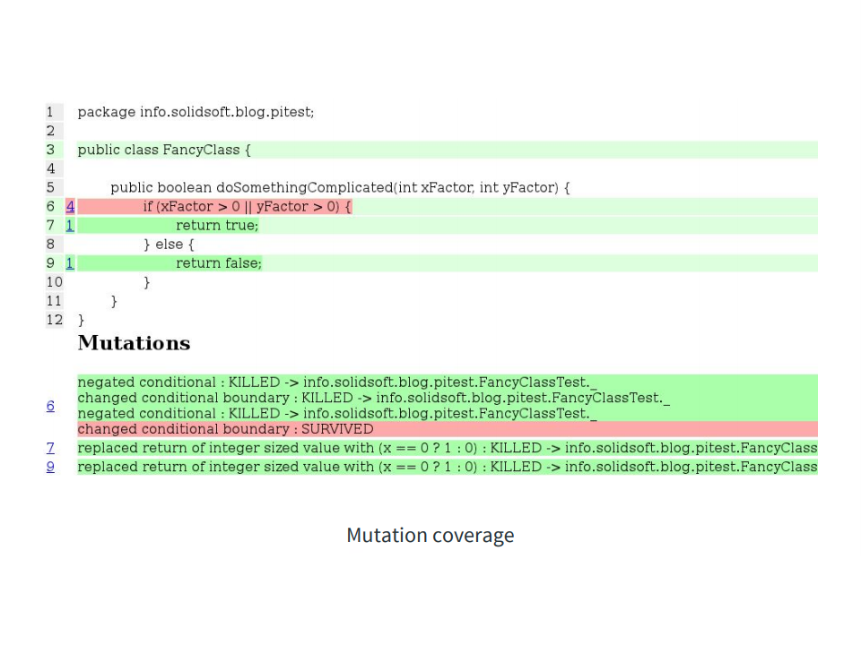

# Did your mocks read the EULA

#### Contracts for your tests

_CodeMobile UK 2018_ 

---


## About… Xavier F. Gouchet

#### Lead Android Engineer at WorkWell 

#### Fluent in Android since Cupcake


###### <a>@xgouchet</a> on <i class="fa fa-github" aria-hidden="true"></i>, <i class="fa fa-stack-overflow" aria-hidden="true"></i>, <i class="fa fa-linkedin" aria-hidden="true"></i>, <i class="fa fa-twitter" aria-hidden="true"></i>, …

+++

## What we do at WorkWell 

`TODO  w/ marketing`

---

> Previously, in CodeMobileUk 2017 …

+++



+++



---

### ♫ Put your hands in the air ♪

 - Unit tests ? <!-- .element: class="fragment" -->
 - Mockito / KotlinMockito? <!-- .element: class="fragment" -->
 - Easymock ? <!-- .element: class="fragment" -->
 - JMockit ? <!-- .element: class="fragment" -->
 - Mockk ? <!-- .element: class="fragment" -->

---

## What are we talking about here

#### Mocks ? Stubs ? Fakes ? Dummies ? 

+++

#### Fakes (aka Dummies)

<small>Dumb POKO, actual value is not relevant</small>


```kotlin
  @Test(expected = IndexOutOfBoundsException::class)
  fun testThrowsException() {
    val dummyUser = User(name = "Bob", id = 42)
    testedList.put(-666, dummy)
  }
```

+++

#### Stubs / Mocks

<small>Objects with scripted answers</small>

```kotlin
  @Test(expected = IllegalArgumentException::class)
  fun testReturnsNull() {
    whenever(mockProvider.getData()) doReturn null
    testedObject.addDataFrom(mockProvider)
  }
```

+++

#### Spies

<small>Can be mock or real objects, just tracking each call</small>

```kotlin
  @Test fun testCallsListener() {
    val spiedListener = spy(realListener)
    testedObject.addListener(spiedListener)
    testedObject.doSomething()
    verify(spiedListener).somethingDone()
  }
```

---

## Fakes

#### What's the problem with fakes

+++

#### All my tests involved users named Alice and Bob. 

#### Aged 42. <!-- .element: class="fragment" -->

#### Working at FooBar Inc. <!-- .element: class="fragment" -->


+++

#### When all your fake data are `“foo”` and `42`,
####  how can you be sure that your tests are valid ?

<ul>
 <li class="fragment">Where does the `42` come from ?</li>
 <li class="fragment">Lots of hardcoded values !</li>
 <li class="fragment">Only one value is tested. Ever.</li>
</ul>

+++

### Solution ? 

#### Use random data…

+++

```kotlin
  @Test fun invalidateDataAfterTimeout() {
    testedObject.setLastCallTimestamp(0)
    testedObject.setDataTTL(42)

    long ts = 666
    boolean result = testedObject.isDataValid(ts)

    assertFalse(result)
  }
```

+++

```kotlin
  @Test fun invalidateDataAfterTimeout() {
    val fakeTS = rand.nextLong()
    val fakeTTL = rand.nextLong()
    val fakeDelay = rand.nextLong()

    testedObject.setLastCallTimestamp(fakeTS)
    testedObject.setDataTTL(fakeTTL)

    val ts = fakeTS + fakeTTL + fakeDelay
    val result = testedObject.isDataValid(ts)

    assertFalse(result)
  }
```

+++

### … but not _too_ random

#### (Long overflow, negative TTL, …)

+++

#### Introducing [Elmyr <i class="fa fa-github" aria-hidden="true"></i>](https://github.com/xgouchet/Elmyr/) 

```kotlin
class FooTest {
  @JvmField @Rule val forger = new JUnitForger()

  // …
}
```

+++

```kotlin
  @Test fun invalidateDataAfterTimeout(){
    val fakeTS = forger.aTimestamp()
    val fakeTTL = forger.aLong(1, 86400000)
    val fakeDelay = forger.aLong(1, 86400000)

    testedObject.setLastCallTimestamp(fakeTS)
    testedObject.setDataTTL(fakeTTL)

    val ts = fakeTS + fakeTTL + fakeDelay
    val result = testedObject.isDataValid(ts)

    assertFalse(result)
}
```

+++

#### Elmyr features

```kotlin
val userId = forger.anHexadecimalString()
val userName = forger.aWord()
val userBio = forger.aSentence()

val userTags = forger.aStringArray(StringConstraint.WORD)

val userEmail = forger.anEmail()
val userHomepage = forger.aUrl()
val userPhone = forger.aStringMatching("(0|+44)\\d{10}")

```

---

## Dealing with Mocks

#### What's the problem with mocks

+++

### Foreword

> “There are two types of mocks:
> inputs and outputs”

+++

#### Input

```kotlin
  @Test fun testSomething() {
    val fakeData = forger.anInt()
    val inputMock = mock()
    whenever (inputMock.getData()) doReturn fakeData

    // Call to getData is not verified directly
  }
```

+++

#### Output

```kotlin
  @Test fun testSomething() {
    val outputMock = mock()
    // mock is not stubbed

    verify(outputMock).onSomethingDone()
  }
```

+++

### The problem:

#### Mocks are designed to make the test pass

+++

### Are your mocks consistent…
#### … between two test methods ? <!-- .element: class="fragment" -->

+++

```kotlin
  @Test fun testFoo() {
    whenever(myMock.isEmpty()) doReturn(true)
    whenever(myMock.isFull()) doReturn(false)
    // …
  }

  @Test fun testBar() {
    whenever(myMock.isEmpty()) doReturn(true)
    whenever(myMock.isFull()) doReturn(true)
    // …
  }
```

+++

### Solution ? 

#### Prepare all the mocks in the setup method…

 - Mocks have single configuration <!-- .element: class="fragment" -->
 - All stubbing is done in one place <!-- .element: class="fragment" -->

+++

### Are your mocks consistent…
#### … between two test classes ? <!-- .element: class="fragment" -->

+++

```kotlin
class Foo {
  @Before fun setupMock() {
    whenever(myMock.isEmpty()) doReturn(true)
    whenever(myMock.getFirst() doThrow(new Exception())
  }
}

class Fiz {
  @Before fun setupMock() {
    whenever(myMock.isEmpty()) doReturn(true)
    whenever(myMock.getFirst() doReturn(null)
    // …
  }
}
```

+++

### Solution ? 

#### Use a separate class to setup the mocks

##### _Introducing Contract based mocking_ <!-- .element: class="fragment" -->

+++

#### Defining the contract

```kotlin
class BarContract {
  val mockedBar : Bar = mock()

  fun prepareEmpty() {
    whenever(mock.isEmpty()).thenReturn(true)
    whenever(mock.isFull()).thenReturn(false)
    whenever(mock.getFirst().thenThrow(new Exception())
  }
}
```

+++

#### Using the contract

```kotlin
class FooTest {
  lateinit var barContract : BarContract

  @Before fun setUpBar() {
    barContract = new BarContract()
  }

  @Test fun testWithEmptyBar() {
    barContract.prepareEmpty()
    val mock = barContract.mockedBar
    // …
  }
}

```

+++

### Are your mocks consistent…
#### … with the concrete implementations ? <!-- .element: class="fragment" -->

 - Fuzzy specs <!-- .element: class="fragment" -->
 - 3rd party implementation <!-- .element: class="fragment" -->
 - Undocumented behavior <!-- .element: class="fragment" -->

+++

### Solution ?

#### Use the contract as test definition

+++

#### Introducing [Mesmaeker <i class="fa fa-github" aria-hidden="true"></i>](https://github.com/xgouchet/Mesmaeker/)

(Still in αlphα)

+++

#### Defining the contract

```kotlin
open class BarContract 
  : MockitoContract<Bar>(Bar::class.java) {

  @Clause
  fun whenEmpty() {
    whenever { it.isEmpty() }.thenReturn(true)
    whenever { it.isFull() }.thenReturn(false)
    whenever { it.getFirst() }.thenThrow(new Exception())
  }
}
```

+++

#### Using the contract

```kotlin
class FooTest {

  @Contract lateinit var barContract: BarContract

  @Test fun testWithEmptyBar() {
    barContract.whenEmpty()
    val mock = barContract.getMock()
    // …
  }
}

```

+++

#### Testing the contract

```kotlin
class BarTest (clause : String)
  : ContractValidator<Bar, BarContract> (clause) {

  override fun instantiateContract()
    : BarContract = BarContract()
  override fun instantiateSubject()
    : Bar = Bar()

  companion object {
    @JvmStatic @Parameterized.Parameters()
    fun data(): Collection<Array<Any?>> {
      return generateTestParameters(BarContract::class.java)
    }
  }
}
```

+++

#### Writing the Clauses of the Contract

```kotlin
  @Clause
  fun withSize(size: Int) {
    applyIfImplementation { it.resize(size) }

    whenever { it.size() }.thenReturn(size)
    whenever { it.get(-1) }.thenThrow(IooBException())
    whenever { it.get(size) }.thenThrow(IooBException())
  }
```

+++

#### Detail's in the fine print

```kotlin
override fun getClauseParams(clause: String): Array<Any?>? {
  when (contractClause) {
    "withSize" -> return arrayOf(forger.aSmallInt())
    else -> return emptyArray()
  }
}
```

---

## Conclusion

 - Remember, test can have bugs too <!-- .element: class="fragment" -->
 - Try to think of what could go wrong <!-- .element: class="fragment" -->
 - Look for the edge cases <!-- .element: class="fragment" -->

+++

> “You need to be as confident in the code you test as you are in the test you code ”

---

## Thanks for your attention

### Any Question ? 

#### <i class="fa fa-github" aria-hidden="true"></i>

[https://github.com/xgouchet/Elmyr](https://github.com/xgouchet/Elmyr)

[https://github.com/xgouchet/Mesmaeker](https://github.com/xgouchet/Mesmaeker)

