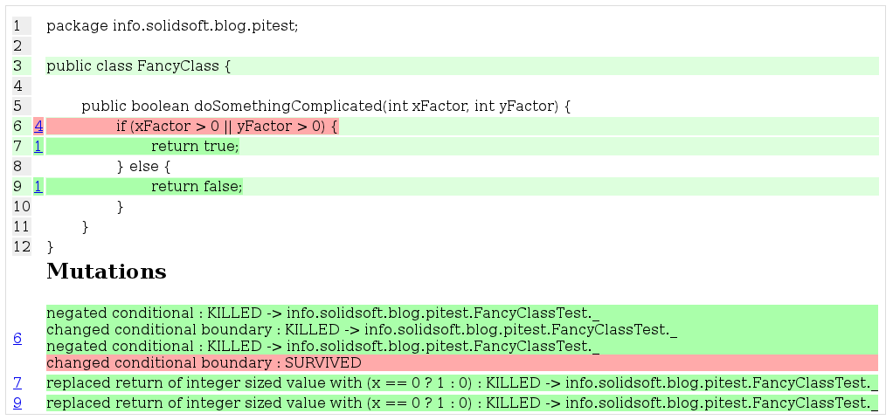

# Genetically Modified Tests

#### An introduction to Mutation Testing


_Droidcon Berlin 2017_ 

---


## About… Xavier F. Gouchet 

<h4 class="fragment">Android Architect at </h4>
#### ‘Mr Tools’ / CI Admin / UT Advocate<!-- .element: class="fragment" -->
#### Fluent in Android since Cupcake <!-- .element: class="fragment" -->

###### <span class="fragment"><a>@xgouchet</a> on <i class="fa fa-github" aria-hidden="true"></i>, <i class="fa fa-stack-overflow" aria-hidden="true"></i>, <i class="fa fa-linkedin" aria-hidden="true"></i>, <i class="fa fa-twitter" aria-hidden="true"></i>, …</span>

---

> ♫ Put your hands in the air ♪
> 
> — Placebo

+++


 - Unit tests ? <!-- .element: class="fragment" -->
 - Integration tests ? <!-- .element: class="fragment" -->
 - Functional tests ? <!-- .element: class="fragment" -->
 - Test Driven Development ? <!-- .element: class="fragment" -->
 - Code Coverage ? <!-- .element: class="fragment" -->
 - Mutation Testing ? <!-- .element: class="fragment" -->

---


### Code has bugs <!-- .element: class="fragment" -->
### Tests are Code <!-- .element: class="fragment" -->
#### ∴ <!-- .element: class="fragment" -->
## Tests have bugs <!-- .element: class="fragment" -->

+++

### Tests ensure the quality of your code, 
## but what ensures the quality of your tests?

---

> ♫ Let's start at the very beginning
> 
> (A very good place to start) ♪
> 
> — Julie Andrews

+++

 <!-- .element: class="photo" -->

##### Unit Tests

+++

 <!-- .element: class="photo" -->

##### Integration Tests

+++

 <!-- .element: class="photo" -->

##### Functionnal Tests

+++

 <!-- .element: class="photo" -->

##### Test Driven Development

+++

 <!-- .element: class="photo" -->

##### Code Coverage

+++

 <!-- .element: class="photo" -->

“SUCCESS: 26/26 (100%) Tests passed” — [_@bloerwald_](http://www.twitter.com/bloerwald) 


+++

> “When a measure becomes a target, 
> it ceases to be a good measure.”
> 
> — Goodhart’s Law

+++

> “The more any indicator is used for decision-making, 
> the more subject it will be to corruption pressures.”
> 
> — Campbell's Law

---

### The goal of tests ? 

 - “Verify that the code works” <!-- .element: class="fragment" -->
 - Make the contract explicit <!-- .element: class="fragment" -->
 - Guide the development (TDD) <!-- .element: class="fragment" -->
 - Prevent regression caused by <!-- .element: class="fragment" -->
     - Other devs <!-- .element: class="fragment" -->
     - Ourselves in the future  <!-- .element: class="fragment" -->
 - Ensure retrocompatibility <!-- .element: class="fragment" -->

+++

#### Bad tests can give 
### a false sense of security

> “We need to be as confident in the tests we code 
> 
> as we are in the code we test.”
> 
> — Me

---

> ♫ We're mutants and we just don't care ♪
> 
> — Oingo Boingo

+++

 <!-- .element: class="float-right" -->

### Mutation Testing 101

1. Write tests <!-- .element: class="fragment" -->
1. Mutate the code¹ <!-- .element: class="fragment" -->
1. Watch the tests fail <!-- .element: class="fragment" -->
1. ??? <!-- .element: class="fragment" -->
1. Profit <!-- .element: class="fragment" -->

+++

### Step 1

Write the tests <!-- .element: class="fragment" -->

<span class="fragment">Make sure all the tests are green <span style="color:#16a085;font-size:150%;">✓</span></span>

+++

### Step 2

Mutate the code¹ <!-- .element: class="fragment" -->

Make one or more modification to the source code <!-- .element: class="fragment" -->

<small class="fragment">Mutation **should** break the behavior of the system</small>

+++

### ¹ What's a mutation ?

#### A modification of a statement in the code <!-- .element: class="fragment" -->

 - Math operations switch <!-- .element: class="fragment" -->
 - Condition boundaries <!-- .element: class="fragment" -->
 - Constant values <!-- .element: class="fragment" -->
 - Return values <!-- .element: class="fragment" -->
 - … <!-- .element: class="fragment" -->

+++

### Step 3

Watch the tests fail <!-- .element: class="fragment" -->

<span class="fragment">At least one test should break for each mutation <span style="color:#c0392b;font-size:150%;">✗</span></span>

… or not <!-- .element: class="fragment" -->

+++

 <!-- .element: class="float-right" -->

### Why would a mutation die ?

 - Test Condition Fails <!-- .element: class="fragment" -->
 - Unexpected Exception <!-- .element: class="fragment" -->
 - Non viable code <!-- .element: class="fragment" -->
 - System error <!-- .element: class="fragment" -->
 - Timeout <!-- .element: class="fragment" -->

+++

 <!-- .element: class="float-right" -->

### Why would a mutation survive ?

 - Uncovered <!-- .element: class="fragment" -->
 - Silent mutation <!-- .element: class="fragment" -->
 - Incomplete / bad test suite <!-- .element: class="fragment" --> 

---

> ♫ Ladies and gentlemen, 
> 
> those magnificent examples of … ♪
> 
> — Paul McCartney

+++

### Example 

```java
int check(boolean a, boolean b) {
  if (a && b) {
    return 42;
  } else {
    return 0;
  }
}

void testCheck() {
  assertEquals(check(true, true), 42);
  assertEquals(check(false, false), 0);
}
```

+++

### Example (mutated)

```java
int check(boolean a, boolean b) {
  if (a || b) { // {a && b} → {a || b}
    return 42;
  } else {
    return 0;
  }
}

void testCheck() {
  assertEquals(check(true, true), 42);
  assertEquals(check(false, false), 0);
}
```

+++


### Example (fixed)


```java
void testCheck() {
  assertEquals(check(true, true), 42);
  assertEquals(check(true, false), 0);
  assertEquals(check(false, true), 0);
  assertEquals(check(false, false), 0);
}
```

---

> ♫ It's time to get our hands dirty ♪
> 
> — Natalie Grant

+++

### Gradle Plugin

```groovy
buildscript {
repositories {
 mavenCentral()
}
dependencies {
 classpath 'pl.droidsonroids.gradle:gradle-pitest-plugin:0.0.9'
}
}

apply plugin: 'pl.droidsonroids.pitest'
```

+++

### Gradle Plugin (2.1+)

```groovy
plugins {
  id "pl.droidsonroids.pitest" version "0.0.9"
}
```

+++

### Configuration

```groovy
pitest {
   targetClasses = ['com.example.*']
   outputFormats = ['XML', 'HTML']
}
```

+++

  <!-- .element: class="photo" -->

+++

  <!-- .element: class="photo" -->

### Hand's on

---

> ♫ There’s somethin’ we can use, 
> 
> so don't say no ♪
> 
> — Tony Basil

+++

### Frequently asked questions

 - It does work with Kotlin… <!-- .element: class="fragment" -->
 - …and other JVM languages too <!-- .element: class="fragment" -->
     - …maybe <!-- .element: class="fragment" -->
 - Configurable <!-- .element: class="fragment" -->
 - Extensible <!-- .element: class="fragment" -->

+++

### Things to keep in mind

 - Mutants won’t find bugs in the code, just reveal test issues <!-- .element: class="fragment" -->
 - Not bulletproof <!-- .element: class="fragment" -->
 - Not a viable metric <!-- .element: class="fragment" -->
 - Only simulate atomic faults <!-- .element: class="fragment" -->
 - Costly  <!-- .element: class="fragment" -->

+++

### My own recommendations

 - Only used locally in the TDD process <!-- .element: class="fragment" -->
 - Automatically triggered per PR <!-- .element: class="fragment" -->
 - Not ran on CI server <!-- .element: class="fragment" -->
 - Coverage value is not shared with management <!-- .element: class="fragment" -->
 - Always take results with a grain of salt <!-- .element: class="fragment" -->

+++

 - Java Framework : Pitest [pitest.org](http://www.pitest.org)
 - IntelliJ / Android Studio plugin : [github.com/zalando/zester](http://www.github.com/zalando/zester)
 - Android gradle plugin : [github.com/koral--/gradle-pitest-plugin](http://www.github.com/koral--/gradle-pitest-plugin)

---

## Thanks for your attention

#### Any Question ? 

