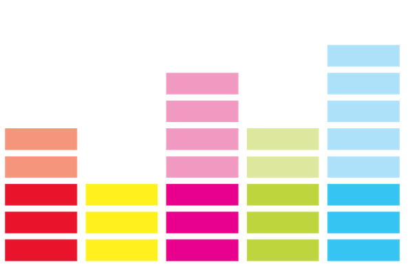
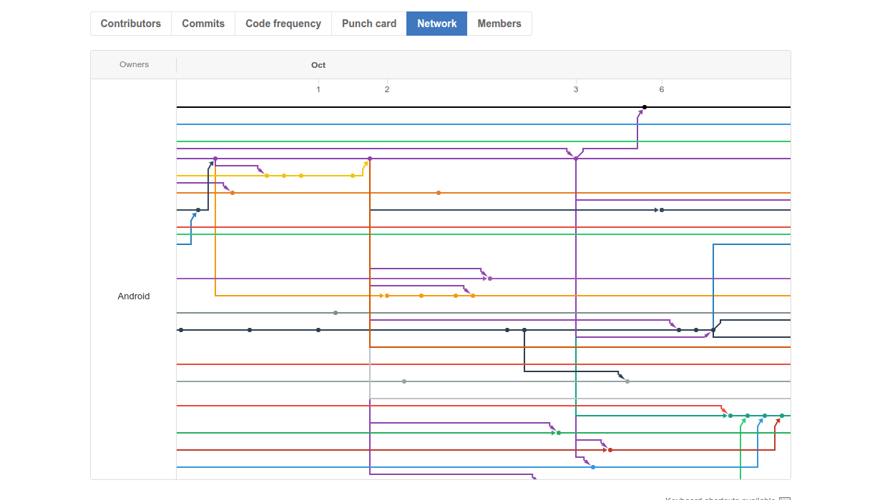
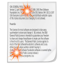
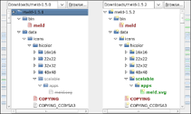
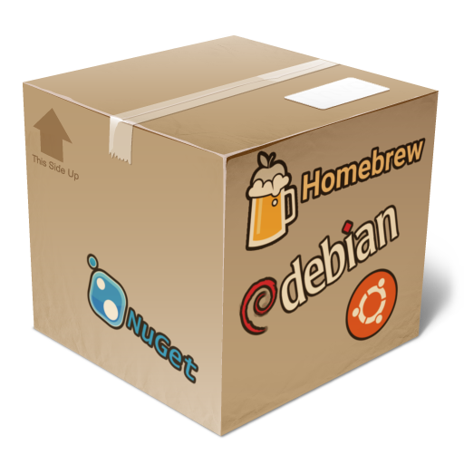

# Merging like it’s 2099 !

#### Introducing the AutoMergeTool

_Droidcon London 2017_ 

---


## About… Xavier F. Gouchet

####    Android Architect at Deezer 

####Fluent in Android since Cupcake

###### <a>@xgouchet</a> on <i class="fa fa-github" aria-hidden="true"></i>, <i class="fa fa-stack-overflow" aria-hidden="true"></i>, <i class="fa fa-linkedin" aria-hidden="true"></i>, <i class="fa fa-twitter" aria-hidden="true"></i>, …

---

> ♫ Put your hands in the air ♪
> 
> — Placebo

+++

 <!-- .element: class="photo white large" -->

### 

+++

 <!-- .element: class="photo white large" -->

### 


+++

 <!-- .element: class="photo white large" -->

### 

---

> ♫ Let's start at the very begining ♪
> 
> — Julie Andrews

+++

### Our first commit

```plain
commit 1e7dfd3e0c6715f3e611975892d8618afb7c33a6
Author: _alex <_alex@...>
Date:   Tue Jan 6 14:56:57 2009 +0000

    Created folder

    git-svn-id: file:///opt/svn-android/trunk@2
                966f65aa-2a5b-49e2-8ec6-7a0f9cdf547d
```

+++

### Since then…

 - 8 years <!-- .element: class="fragment" -->
 - 12’000+ commits <!-- .element: class="fragment" -->
 - 4 main repositories <!-- .element: class="fragment" -->
 - 30+ different committers <!-- .element: class="fragment" -->
 - 750’000+ lines of code <!-- .element: class="fragment" -->
 - 100’000+ lines of comments <!-- .element: class="fragment" -->
 - 10’000+  source files <!-- .element: class="fragment" -->

---

> ♫ Too many problems, 
> 
> Oh why am I here ♪
> 
> — Megadeth

+++

## CVS is text based !

+++

### Text based versionning

 - Diff / Merge is based on a stream of characters <!-- .element: class="fragment" -->
 - Easy (and fast-ish) to compute <!-- .element: class="fragment" -->
 - Recognizes newlines / whitespace <!-- .element: class="fragment" -->
 - Doesn’t understand any syntax¹ <!-- .element: class="fragment" -->

+++

### Common conflicts

<ul>
 <li class="fragment">The `imports` section</li>
 <li class="fragment">Same change on both sides</li>
 <li class="fragment">Additions at the same place</li>
 <li class="fragment">Changes in different lines in same block</li>
 <li class="fragment">Unrelated changes on same line</li>
 <li class="fragment">… ?</li>
</ul>

+++

> “Most of those are fairly easy to solve, but usually tedious.”


---

> ♫ There must be a better way
> 
> to make the things we want… ♪
> 
> — Paul Mc Cartney

+++

## AutoMergeTool

+++

### Basic principle

<ul>
 <li class="fragment">Integrate with </li>
 <li class="fragment">Integrate with 3rd party tools</li>
 <li class="fragment">Many simple automatic solvers</li>
 <li class="fragment">Language agnostic</li>
 <li class="fragment">Manual solving as a “last resort” solution</li>
</ul>

+++

### Example 1 : easy case

```bash
$ git merge master
```

+++

#### Example 1 : easy case

 <!-- .element: class="ghost small" -->

```bash
$ git mergetool
… 
[AMT] → Trying merge with tool1
```

+++

#### Example 1 : easy case

 <!-- .element: class="ghost small" -->

```bash
… 
[AMT] ✗ tool1 didn’t solve all conflicts
[AMT] → Trying merge with tool2
```

+++

#### Example 1 : easy case

 <!-- .element: class="ghost small" -->

```bash
… 
[AMT] ✗ tool2 didn’t solve all conflicts
[AMT] → Trying merge with tool3
```

+++

#### Example 1 : easy case

 <!-- .element: class="ghost small" -->

```bash
…
[AMT] ✓ tool3 merged successfully
…
```
+++

### Example 2 : harder case

```bash
$ git merge master
```

+++

#### Example 2 : harder case

 <!-- .element: class="ghost small" -->

```bash
$ git mergetool
… 
[AMT] → Trying merge with tool1
```

+++

#### Example 2 : harder case

 <!-- .element: class="ghost small" -->

```bash
… 
[AMT] ✗ tool1 didn’t solve all conflicts
[AMT] → Trying merge with tool2
```

+++

#### Example 2 : harder case

 <!-- .element: class="ghost small" -->

```bash
… 
[AMT] ✗ tool2 didn’t solve all conflicts
[AMT] → Trying merge with tool3
```

+++

#### Example 2 : harder case

 <!-- .element: class="ghost small" -->

```bash
…
[AMT] ✗ tool2 didn’t solve all conflicts
[AMT] → Trying merge with manualToolX
```

+++

#### Example 2 : harder case

 <!-- .element: class="ghost small" -->


---

## Configuration
#### `~/.gitconfig` or `{project}/.git/config`

+++


```ini
[merge]
tool = amt
conflictstyle = diff3


[mergetool "amt"]
cmd = amt.py -l $LOCAL -r $REMOTE -b $BASE -m $MERGED
```

+++

```ini
[amt]
tools = java_imports;gen_additions;custom;meld


[mergetool "java_imports"]
order = android


[mergetool "custom"]
cmd = custom.sh "$LOCAL" "$REMOTE" "$MERGED"
extensions = html;xml
```

---

## Automatic solvers

+++

### Language agnostic

 - Addition at the same line <!-- .element: class="fragment" -->
 - Deleting the same block <!-- .element: class="fragment" -->
 - Woven conflicts <!-- .element: class="fragment" -->
 - Conflict simplification <!-- .element: class="fragment" -->
 - … <!-- .element: class="fragment" -->

+++

### Language specifics

 - Java Imports <!-- .element: class="fragment" -->
 - Kotlin Imports (WIP) <!-- .element: class="fragment" -->
 - … <!-- .element: class="fragment" -->

---

## Early results

+++

### First try : 

<h4 class="fragment">Rebased a huuuge commit (<span style="color:#16a085;">+1537</span>/<span style="color:#c0392b;">-3250</span>)</h4>

 - Number of conflicted files : 37 <!-- .element: class="fragment" -->
 - Number of conflicts : 62 <!-- .element: class="fragment" -->
 - Number of conflicts solved manually : 3 <!-- .element: class="fragment" -->
 - Time spent : 2 minutes <!-- .element: class="fragment" -->
     - plus time to write AutoMergeTool <!-- .element: class="fragment" -->

+++

### Daily use since december 2016

 - Number of manual conflicts down by 75% <!-- .element: class="fragment" -->
 - Mood increased by 200% <!-- .element: class="fragment" -->

+++

### Going further

 <!-- .element: class="ghost medium" -->

+++

### Going further

 <!-- .element: class="ghost medium" -->

[github.com/xgouchet/AutoMergeTool](http://www.github.com/xgouchet/AutoMergeTool) :  

+++

### Going further

 <!-- .element: class="ghost medium" -->

```bash
$ pip install automergetool
```

+++

### ¹ Going *even* further

<ul>
 <li class="fragment"> <a href="https://www.semanticmerge.com">Semantic Merge</a> ($6.90/month)</li>
 <li class="fragment"> <a href="https://www.deltaxml.com">Delta XML</a> (XML only)</li>
 <li class="fragment"><a href="http://blog.locut.us/2011/02/06/why-doesnt-this-exist-yet-syntax-aware-merge/">Why doesn’t this exist yet: Syntax-aware merge</a></li>
</ul>

---

## Thanks for your attention

### Any Question ? 

#### See also [codereview.stackexchange.com](https://codereview.stackexchange.com)


