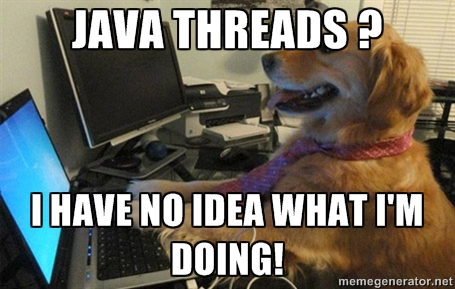
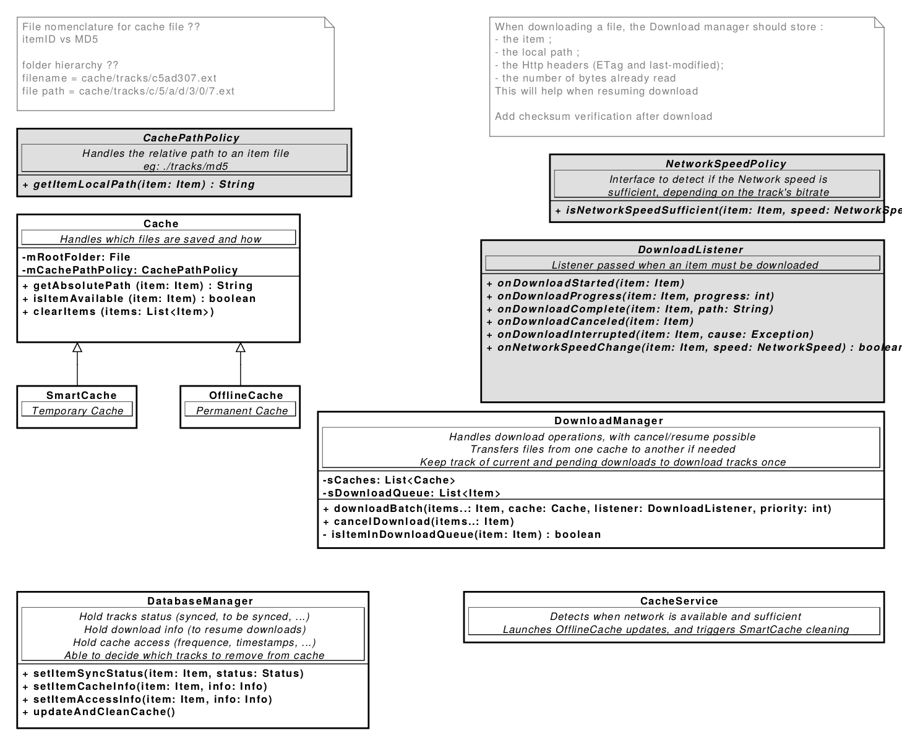
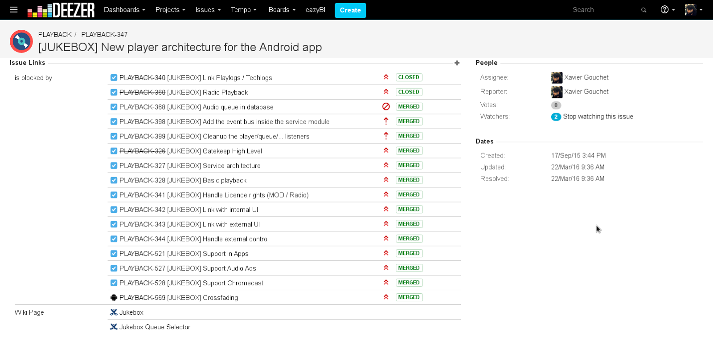

# Legacy code

#### How to deal with code you didn't write

_Wild Code School_ 

---

 <!-- .element: class="logo white" -->

## About…  Xavier F. Gouchet 

#### Android Architect <!-- .element: class="fragment" -->
#### ‘Mr Tools’ / CI / UT <!-- .element: class="fragment" -->
#### Fluent in Android since Cupcake <!-- .element: class="fragment" -->

###### <span class="fragment"><a>@xgouchet</a> on <i class="fa fa-github" aria-hidden="true"></i>, <i class="fa fa-stack-overflow" aria-hidden="true"></i>, <i class="fa fa-linkedin" aria-hidden="true"></i>, <i class="fa fa-twitter" aria-hidden="true"></i>, …</span>

+++

### And before that … ?

 <!-- .element: class="fragment logo white" -->
 <!-- .element: class="fragment logo white" -->
 <!-- .element: class="fragment logo white" -->
 <!-- .element: class="fragment logo white" -->

---

## What is legacy code ? 

> ♫ It's a chronicling of our rise… ♪
> 
> — Tenacious D

+++

### What is legacy code ?

 - Code including anti-patterns<!-- .element: class="fragment" -->
 - Code with (almost) no tests<!-- .element: class="fragment" -->
 - Code written hastily (#deadlines)<!-- .element: class="fragment" -->
 - Temporary code (#quickfix)<!-- .element: class="fragment" -->
 - Code written by someone else<!-- .element: class="fragment" -->
 - Code written before now<!-- .element: class="fragment" -->

#### in one word : Code ! <!-- .element: class="fragment" -->

+++

### Why is it bad ? 

 - Poor performances <!-- .element: class="fragment" -->
 - Buggy <!-- .element: class="fragment" -->
 - Hard to read <!-- .element: class="fragment" -->
 - Hard to understand <!-- .element: class="fragment" -->
 - Hard to maintain <!-- .element: class="fragment" -->

+++

### Why is it still there ? 

 - Too long to change <!-- .element: class="fragment" -->
 - Too hard to change <!-- .element: class="fragment" -->
 - No one knows how it works <!-- .element: class="fragment" -->
 - Why fix it if it ain't broken <!-- .element: class="fragment" -->

+++

### What can we do about it ?

 - Weep ?<!-- .element: class="fragment" -->
 - Blame ?<!-- .element: class="fragment" -->
 - Improve !<!-- .element: class="fragment" -->

---

### My personal experience with

## Legacy Code

+++

```bash
    commit 1e7dfd3e0c6715f3e611975892d8618afb7c33a6
    Author: _alex <_alex@...>
    Date:   Tue Jan 6 14:56:57 2009 +0000
    
        Created folder
```

+++

 - 8 years <!-- .element: class="fragment" -->
 - 12’000+  commits <!-- .element: class="fragment" -->
 - 30+  different committers <!-- .element: class="fragment" -->
 - 750’000+  lines of code* <!-- .element: class="fragment" -->
 - 200’000+  lines of comments* <!-- .element: class="fragment" -->
 - 7’500+  source files* <!-- .element: class="fragment" -->

<small class="fragment">* As of June 2017</small>

+++

#### We had 8 big refactoring in the past 4 years. 

### Let’s look at 3 “post-mortem”

---

## 1 : The ugly

> “The only valid measurement of code quality : WTFs / Minute.”
> 
> — Thom Holwerda

+++

<!-- .element: class="photo" -->

### No code reviews

+++

<!-- .element: class="photo" -->

### No vision ahead

+++

<!-- .element: class="photo" -->

### Lasagna architecture

+++

<!-- .element: class="photo" -->

### Bad thread strategy

+++

<!-- .element: class="photo" -->

### Many (ugly) duplicates

+++

<!-- .element: class="photo" -->

### No unit tests

---

## 2 : The bad

> “Programming is like sex. One mistake and you have to support it for the rest of your life.”
> 
> — Michael Sinz

+++

<!-- .element: class="photo" -->

### From scratch

+++

<!-- .element: class="photo" -->

### No idea what the previous system did

+++

<!-- .element: class="photo" -->

### Architecture beforehand

+++

<!-- .element: class="photo" -->

### Still no code review

+++

<!-- .element: class="photo" -->

### Tests… Kinda…

+++

<!-- .element: class="photo" -->

### Tests were not updated

+++

<!-- .element: class="photo" -->

### Urgency → mistakes 
#### _#deadline_<!-- .element: class="fragment" -->

---

## 3 : The good

> “When debugging: novices insert corrective code; experts remove defective code.”
> 
> — Richard Pattis

+++

<!-- .element: class="photo" -->

### Existing code assessed

+++

<!-- .element: class="photo" -->

### We had a plan

+++

<!-- .element: class="photo" -->

### We had a plan

+++

<!-- .element: class="photo" -->

### We prepared the refactoring

+++

<!-- .element: class="photo" -->

### Each step was (unit) tested

+++

<!-- .element: class="photo" -->

### No deadline

+++

<!-- .element: class="photo" -->

### Progressive release (beta, gatekeep)

---

## Dealing with legacy code

> “There are two ways to refactor legacy code;
> Only the third one works.”
>
> — Alan J. Perlis

+++

### Don't judge; Understand

 - Why is the code written that way ?<!-- .element: class="fragment" -->
    - (old) constraints<!-- .element: class="fragment" -->
    - rushed code<!-- .element: class="fragment" -->
    - bad specs<!-- .element: class="fragment" -->
 - What can be done about it ?<!-- .element: class="fragment" -->

+++

### Trivial changes first

 - Renaming <!-- .element: class="fragment" -->
     - FooManager <!-- .element: class="fragment" -->
     - BarUtils <!-- .element: class="fragment" -->
     - BazData<!-- .element: class="fragment" -->
 - Moving <!-- .element: class="fragment" -->
 - Splitting <!-- .element: class="fragment" -->


+++

### Plan ahead

 - What needs to be done ? <!-- .element: class="fragment" -->
 - In what order ? <!-- .element: class="fragment" -->

+++

### Resist the urge to rewrite everything

---

## The refactoring algorithm

> ♫ There must be a better way 
> 
> to make the things we want… ♪
> 
> — Paul Mc Cartney

+++


<!-- .element: class="photo" -->

### “Know your enemy”

#### Identify change points

+++

<!-- .element: class="photo" -->

### “Mark the cuts”

#### Find test points

+++

<!-- .element: class="photo" -->

### “Cut ties”

#### Break dependencies

+++

<!-- .element: class="photo" -->

### “Protect yourself”

#### Write tests

+++

<!-- .element: class="photo" -->

### “Do it !”

#### Refactor

---

## Refactoring gone wrong

> ♫ So let this serve as a reminder
> 
> A warning sign ♪
> 
> — Disturbed

+++

<!-- .element: class="photo" -->

### Don't reinvent the wheel

+++

<!-- .element: class="photo" -->

### Beware the second system effect

+++

<!-- .element: class="photo" -->

### Avoid lava layer refactorings

+++

<!-- .element: class="photo" -->

### Overkilled complexification

---

## Legacy Code is not inevitable

> ♫ It's inevitable, inevitable, 
> 
> it's a soul destroyed ♪
> 
> — Radiohead

+++

### Follow best practices

 - Standard conventions<!-- .element: class="fragment" -->
 - Tools and libraries<!-- .element: class="fragment" -->

+++

### Find the right name

 - Describe everything the routine does <!-- .element: class="fragment" -->
 - Make names as long as necessary<!-- .element: class="fragment" -->
 - Avoid meaningless, vague, or wishy-washy verbs<!-- .element: class="fragment" -->

+++

### Reuse exisiting code

 - Don't rewrite for the sake of rewriting<!-- .element: class="fragment" -->
 - Don't think you're smarter<!-- .element: class="fragment" -->
 - If it works and suits your need, use it<!-- .element: class="fragment" -->

+++

### Document everything

 - Document the feature specs<!-- .element: class="fragment" -->
 - Document the bug fixes and special cases<!-- .element: class="fragment" -->
 - // TODO Leave instructions for future self <!-- .element: class="fragment" -->

---

## SOLID 

> ♫ I wanna live on solid rock ♪
> 
> — Dire Straits

+++

> “A class should have only one reason to change”
> 
> —  Single Responsibility

+++

> “Software entities should be open for extension but closed for modification.”
> 
> —  Open / Closed

+++

> “Subtypes must be substitutable for their base types.”
> 
> —  Liskov Substitution 

+++


> “Clients should not be forced to depend on methods they do not use.”
>
> —  Interface Segregation

+++


> “A. High-level modules should not depend on low-level modules.  Both should depend on abstractions.
> 
> B. Abstractions should not depend upon details.  Details should depend upon abstractions.”
> 
> — Dependency Inversion
---

## Test everything

> ♫ I'm always testing the s*** around me ♪
> 
> — Korn

+++

<!-- .element: class="photo" -->

### Unit Testing

+++


<!-- .element: class="photo" -->

### Integration testing

+++


<!-- .element: class="photo" -->

### Functional Testing

+++


<!-- .element: class="photo" -->

### Test driven development

---

## Code Reviews

> ♫ Then settle back and just sit tight
> 
> While I start reviewing ♪
> 
> — Johnny Mercer

+++

### Why code reviews 

 - Find defects early<!-- .element: class="fragment" -->
 - Harmonize code base<!-- .element: class="fragment" -->
 - Generate discussion<!-- .element: class="fragment" -->
 - Share knowledge<!-- .element: class="fragment" -->
 - Team Building<!-- .element: class="fragment" -->

+++

### Workflows

 - Pre vs Post Commit<!-- .element: class="fragment" -->
 - Mandatory vs Optional<!-- .element: class="fragment" -->
 - Remote vs Pair Review<!-- .element: class="fragment" -->
 - Static Analysis<!-- .element: class="fragment" -->

+++

### Reviewing code 

 - Be precise<!-- .element: class="fragment" -->
     - “This uses too much memory…”<!-- .element: class="fragment" -->
 - Argument<!-- .element: class="fragment" -->
     - “… because this object is not retained when …”<!-- .element: class="fragment" -->
 - Help fix it<!-- .element: class="fragment" -->
     - “You could instead use …”<!-- .element: class="fragment" -->
 - Define criticality<!-- .element: class="fragment" -->
     - “It’s not urgent and can be done in a later commit”<!-- .element: class="fragment" -->

+++

### Overall Behavior

 - Always review your own code<!-- .element: class="fragment" -->
 - Stay humble and open to criticism<!-- .element: class="fragment" -->
 - Use proper justification for your choice<!-- .element: class="fragment" -->
 - Make it about the code, not the people<!-- .element: class="fragment" -->
 - Learn and share knowledge<!-- .element: class="fragment" -->

---

## Thanks for your attention

### Trainee jobs ? [tat@deezer.com](tat@deezer.com)

#### Any Question ? 